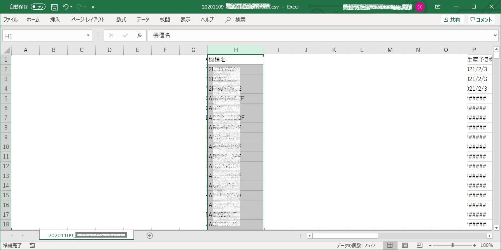
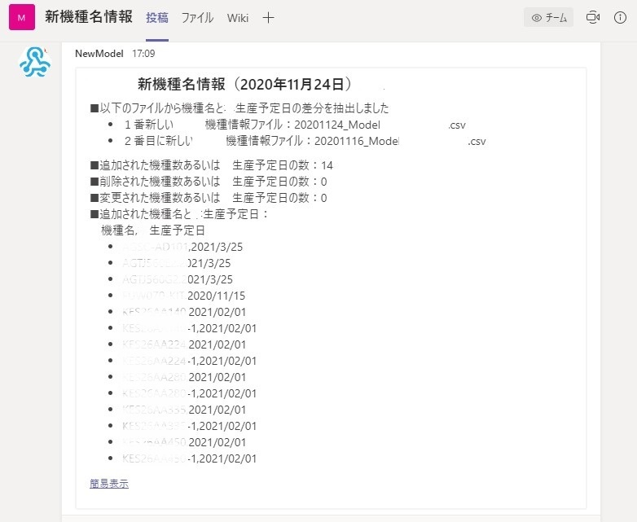
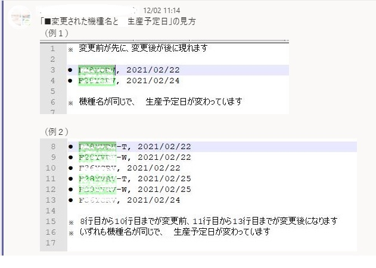
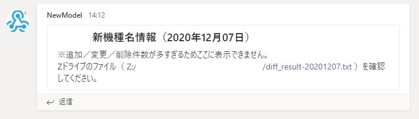

<!-- TOC -->

- [CSVファイルから特定の列の差分を抽出しTeamsに通知するツール](#csvファイルから特定の列の差分を抽出しteamsに通知するツール)
  - [*model-teams+c.sh*](#model-teamscsh)
  - [1. 概要](#1-概要)
    - [1.1 入力ファイル](#11-入力ファイル)
    - [1.2 出力ファイル](#12-出力ファイル)
    - [1.4 Teams 投稿イメージ](#14-teams-投稿イメージ)
  - [2. 動作環境](#2-動作環境)
    - [2.1 サーバー](#21-サーバー)
    - [2.2 シェルとスケジューラーの実行ユーザー](#22-シェルとスケジューラーの実行ユーザー)
    - [2.3 ファイルの保存場所とファイル名](#23-ファイルの保存場所とファイル名)
    - [2.4 実施する内容](#24-実施する内容)
    - [2.5 実施しない内容](#25-実施しない内容)
    - [2.6 シェルスクリプト](#26-シェルスクリプト)
  - [3. スケジュール](#3-スケジュール)

<!-- /TOC -->

---
# CSVファイルから特定の列の差分を抽出しTeamsに通知するツール

## *model-teams+c.sh*

---

## 1. 概要

　毎週、特定の部門から関係者に届くメールに添付されている`CSV`ファイルについて、１週間前の`CSV`ファイルと差分を取り、新しく追加・削除・変更された列（例えば機種名と生産予定日）を抽出し、抽出結果をファイルに保存し、`Teams`に投稿するツールです。

### 1.1 入力ファイル

- 入力ファイルは、約`2500`行X`46`列にわたる`CSV`ファイル
- ファイルの例（H列に機種名、P列に生産予定日）
  

### 1.2 出力ファイル

- 以下の情報を記録した抽出結果ファイルを生成する
  - ファイル名は、`diff_result-YYYYMMDD.txt`
  - 差分対象ファイル
    - 最新と2番目に新しい`CSV`ファイル
    - ファイル名の最後が`Model`で終わり、拡張子が`csv`であること
    - （例）`20201109_Model.csv`
  - 追加・削除・変更された機種名と、生産予定日の数
  - 追加・削除・変更された機種名と、生産予定日の一覧

- 抽出結果ファイル（`diff_result-20201124.txt`）の出力例

  ```bash
  \n\n■以下のファイルから機種名と生産予定日の差分を抽出しました
  \n\n- １番新しい機種情報ファイル：20201124_Model.csv
  \n\n- ２番目に新しい機種情報ファイル：20201116_Model.csv
  \n\n
  \n\n■追加された機種数あるいは生産予定日の数：14
  \n\n
  \n\n■削除された機種数あるいは生産予定日の数：0
  \n\n
  \n\n■変更された機種数あるいは生産予定日の数：0
  \n\n
  \n\n■追加された機種名と生産予定日：
  \n\n　機種名,生産予定日
  \n\n- "AxxC-Axx01","2021/3/25"
  \n\n- "AGxxE2","2021/3/25"
  \n\n- "AGxxG2","2021/3/25"
  \n\n- "Fyyy70","2020/11/15"
  \n\n- "KEzzzAA40","2021/02/01"
  \n\n- "KEzzzAA40-1","2021/02/01"
  \n\n- "KEzzzA22","2021/02/01"
  \n\n- "KEqqqAA22","2021/02/01"
  \n\n- "KEqqqAA28","2021/02/01"
  \n\n- "KEqqqAA28","2021/02/01"
  \n\n
  ```

  - （注）`Teams`に投稿するために改行コード`\n`をエスケープしていない

### 1.4 Teams 投稿イメージ

- 以下の内容を投稿する
  

- 変更点がある場合の表示について
  

## 2. 動作環境

### 2.1 サーバー

- `Linux`(`CentOS7`)
- あらかじめ`Windows`のフォルダー`Z:\model/`を`/mnt/z/model`フォルダーとしてマウントしておく

### 2.2 シェルとスケジューラーの実行ユーザー

- `vuls`

### 2.3 ファイルの保存場所とファイル名

- メール受信者は、スケジュール実行日時までに、メールに添付されている`model`機種情報ファイル（`CSV`ファイル）を`Z`ドライブの以下のフォルダーに保存すること
- 保存先は、`Z:\model`（以下、`model`フォルダーと呼ぶ）
- **`model`機種情報ファイル名に関する制約**
  - ファイル名の最後は、`model`、拡張子は`csv`であること
  - （例）20201109_**model**.**csv**
- シェルスクリプト
  - 実行ファイルであるシェルスクリプト`model-teams+a.sh`の保存先は、`/home/vuls/model/model-teams+a.sh`
- 新機種名の抽出結果は、ファイル`diff_result-yyyymmdd.txt`に保存する
  - （例）1番新しい`model`機種情報ファイルが、`20201109_Model.csv`のとき、結果ファイル名は、`diff_result-20201109.txt`となる
  - `diff_result-yyyymmdd.txt`の保存先は、`Z`ドライブの`Z:\model\done`
  
### 2.4 実施する内容

- `model`フォルダーに保存されている`model`機種情報ファイル群から、最新の2つのファイルを特定する
- 最新と2番目に新しいファイルについて、"機種名"と"生産予定日"の列を抜き出したリストを作る
- 2つのリストの差分をとる(A)
- 追加・削除・変更された機種の数を数える(B)
- 追加・削除・変更された機種名と生産予定日のリストを作る(C)
- (A)(B)(C)を結果ファイル`diff_result-yyyymmdd.txt`に保存する
- 保存したファイルの内容を`Teams`に投稿する
- 追加／変更／削除件数が合わせて、`150`件以上ある場合は、その旨を通知する
  - 

### 2.5 実施しない内容

- ~~削除された機種の抽出~~
- ~~機種名に変更があった機種の抽出~~
- 複数の変更が連続する場合、変更があった順に、変更前後の内容を表示する（変更前の内容を順に表示してから、変更後の内容を順に表示する）

### 2.6 シェルスクリプト

- シェルスクリプトの抜粋`model-teams+c.sh`

  ```bash 
  # Teams 投稿用ファイルの作成
  # -e 付けない（エスケープを解釈しない）、-n 最後の改行を出力しない
  # echo -n "{\"title\": \"$TITLE（${UPDATE_DATE}）\", \"text\": \"- 機種名,生産予定日" > toTeams.json
  # {"title": "model-新機種情報（20201116）", "text": "- 機種名,生産予定日
  
  echo -n "{\"title\": \"$TITLE（${UPDATE_DATE}）\", \"text\": \"" > toTeams.json
  # {"title": "model-新機種情報（20201116）", "text": 
  
  # 追加・変更・削除の合計が多いときはメッセージ
  if [ $((TOTAL_COUNT)) -gt 150 ]; then
      # 多すぎます
      echo -n "※追加／削除／変更件数が多すぎるためここに表示できません。\n\nZドライブのファイル（ [Z:/model/done/$DIFF_RESULT_Z_FILE](Z:/model/done/$DIFF_RESULT_Z_FILE) ）を確認してくださ い"。 >> toTeams.json
  else
      # 整形
      sed -e 's/\"\,\"/\,/g' -e 's/\"//g' ${DIFF_RESULT_Z_FILE} | tr -d "\n" >> toTeams.json
  fi
  
  # } 閉じ
  echo "\"}" >> toTeams.json
  # {"title": "model-新機種情報（20201116）", "text": "\n\n■以下のファイルから（中略）\n\n- AN22YVS-WA,2021/02/ 23\n\n"}
  ```

- **`Teams`投稿部分の解説**

  - `model`機種情報ファイルからファイル名の先頭`8`文字を"`yyyy`年`mm`月`dd`日"に変換して変数`UPDATE_DATE`に代入する
  - `20201116`が`2020年11月16日`となる
  
    ```bash
    # csv to Teams Json
    # 更新日
    UPDATE_DATE=`date -d ${LATEST_DATE} "+%Y年%m月%d日"`
    ```

  - `curl`コマンドで`webhook`に投稿する文章を`Json`形式（`Teams`の制約あり）で作成する
  - `Teams`が受け取る（解釈できる）`Json`は、`{"title":"....", "text":"..."}`であり、`{ }`内は改行無しの1文で書く必要がある。
  - 改行は`\\n`で渡す
  - `MarkDown`が使える
  - `curl`コマンドで、投稿するデータ（`-d`オプション部分）をファイルから読み込むために、`toTeams.json`ファイルを作成する
  - タイトルは、キーが`"title"`、値`"$TITLE（${UPDATE_DATE}）"`で、値は「**model-新機種情報（2020年11月16日）**」に置換する
  - `"`を`\`でエスケープして与えるので、`echo`コマンドに`-e`オプションは使わない
  - `"text"`部分を改行せずに連結するために、`echo`コマンドに`-n`オプションを使う

    ```bash
    # -e 付けない（エスケープを解釈しない）、-n 最後の改行を出力しない
    echo -n "{\"title\": \"$TITLE（${UPDATE_DATE}）\", \"text\": \"" > toTeams.json
    ```

  - 差分ファイル`${DIFF_RESULT_FILE}`を、`diff_result.txt`に置換する
  - `diff_result.txt`の内容

    ```bash
    *** latest2.txt	2020-11-24 17:04:22.465585827 +0900
    --- latest1.txt	2020-11-24 17:04:22.631585825 +0900
    ***************
    *** 20,25 ****
    --- 20,28 ----
      "Axx70X","2020/09/25"
      "ACxx55X","2020/09/25"
      "ACzz70X","2020/09/25"
    + "ACqqq101","2021/3/25"
    + "AGttt56","2021/3/25"
    + "AGuuu56","2021/3/25"
      "AJr22C","2020/09/04"
      "AJr22F","2020/12/22"
      "AJr25S","2020/09/04"
    ***************
    *** 1260,1265 ****
    --- 1263,1269 ----
      "FUww40","2020/11/15"
      "FUWw50","2020/11/15"
      "FUww60","2020/11/15"
    + "FUww70","2020/11/15"
      "FVpp27K","2020/10/01"
      "FVpp27M","2020/10/01"
      "FVpp27MA","2020/10/01"
    ***************
    *** 1585,590 ****
      ```

  - 削除・変更された機種名と生産予定日に対応するために、`diff`コマンドのオプションを`-u`（ユニファイド）から`-c`（コンテキスト）に変更した
  - `Json`ファイル`toTeams.json`に追記する文を作成する
  - `grep`の結果をパイプで`、sed`と、`tr`に渡し、`Json`ファイル`toTeams.json`に保存する
  - `tr`で、改行コード`LF(\n)`を削除し1文に整形している
   
    ```bash
    # 整形
    sed -e 's/\"\,\"/\,/g' -e 's/\"//g' ${DIFF_RESULT_Z_FILE} | tr -d "\n" >> toTeams.json
    ```

  - `grep '^+ \"' ${DIFF_RESULT_FILE} `で、`+ "`から始まる行だけ抽出する
  - 結果

    ```bash
    + "BA29A11","2020/11/17"
    + "BA29A12","2020/11/17"
    + "BA29A13","2020/11/17"
    + "BA29A50","2020/11/17"
    + "BA29A51","2020/11/17"
    + "BA29A80","2020/11/17"
    ...
    ```
  
  - 先頭の`+ "`を`\n\n- `に置換する
  - 改行コードは、エスケープするため`\\n`となる
  - `MarkDown`を使うために改行コードは`2つ`必要
  - `-`は、`MarkDown`のリスト表示
  - この結果を`sed -e 's/\"\,\"/  \, /g'`で置換する
  - `sed`を繰り返す際は、`sed`を省略し、`-e`で繰り返すことができる
  - ここでは、機種名と生産予定日の間の`,`と`"`を`,`に置換する
  - 結果

    ```bash
    \n\n- BA249A11,2020/11/17"
    \n\n- BA249A12,2020/11/17"
    \n\n- BA249A13,2020/11/17"
    \n\n- BA249A50,2020/11/17"
    \n\n- BA249A51,2020/11/17"
    \n\n- BA249A80,2020/11/17"
    ...
    ```

  - さらに、この結果をパイプで`sed -e 's/\"//g'`に渡して文末の`"`を削除する
  - 結果

    ```bash
    \n\n- BA249A11,2020/11/17
    \n\n- BA249A12,2020/11/17
    \n\n- BA249A13,2020/11/17
    \n\n- BA249A50,2020/11/17
    \n\n- BA249A51,2020/11/17
    \n\n- BA249A80,2020/11/17
    ...
    ```

  - 最後に、1文にするために、この結果をパイプで`tr -d "\n"`に渡し、各行の文末にある改行コード`LF`を削除する
  - 結果

    ```bash
    \n\n- BA249A11,2020/11/17\n\n- BA249A12,2020/11/17\n\n- BA249A13,2020/11/17...\n\n- BA249A80,2020/11/17
    ...
    ```

  - 閉じかっこ`}`を追加する
  
    ```bash
    # } 閉じ
    echo "\"}" >> toTeams.json
    ```
  
  - 結局以下の内容のデータができる
  - 結果

    ```bash
    {"title": "model-新機種情報（20201116）", "text": "\n\n■以下のファイルから（中略）\n\n- ANYVS123,2021/02/23\n\n（中略）- RXX805A, 2021/02/ 02"}
    ```

  - `Teams`へ投稿する
    - `-X`オプションを使って、クラウドプロキシーを指定する
    - `-H`オプションを使って、ヘッダに`Json`形式を指定する
    - `POST`サブコマンドを使って投稿する
    - `-d@`オプションを使って、投稿するデータをファイル`toTeams.json`から読みだす
    - `${model_URL}`は投稿先の`Webhook`アドレス
  
    ```bash
    # Teamsへ投稿
    echo "Teams へ投稿します"
    curl -x proxy.abcd.com:3128 -H "Accept: application/json" -H "Content-type: application/json" -X POST \
    	 -d @toTeams.json ${model_URL}
    ```

## 3. スケジュール

- 毎週火曜日の午後3時に、`cron`によるスケジュールを実施する
- スケジュールの保存場所とファイル名は、`/var/spool/cron/vuls`
  - 編集する場合は管理者(`root`)権限が必要
- `cron`の内容（最下行）
  
  ```bash
  PATH=/sbin:/bin:/usr/bin:/usr/local/bin:/usr/local/sbin:/usr/sbin:/usr/local/go/bin:/home/vulsgo/  bin:/usr/lib/jvm/java/bin:/opt/apache-tomcat/apache-tomcat-7.0.50/bin:/home/vuls/.local/bin:home/  vuls/bin:MAIL=/var/spool/mail/vuls
  # 分　時　日　月　曜日　コマンド
  05 6 * * 1-5 /home/vuls/vuls-auto2.sh full diff > /var/log/vuls/vuls-auto.log 2>&1
  00 15 * * 1-5 /home/vuls/z-today-mail2.sh > /var/log/vuls/z-today-mail.log 2>&1
  00 7 1 * * /home/vuls/Google/google_pwgen.sh > /home/vuls/Google/log/google_pwgen.log 2>&1
  30 11 * * 1 /home/vuls/CAcert/cacert-checkend.sh > /home/vuls/CAcert/cacert-checkend.log 2>&1
  00 15 * * 2 /home/vuls/model/model-teams+c.sh > /home/vuls/model/model.log 2>&1
  ```
